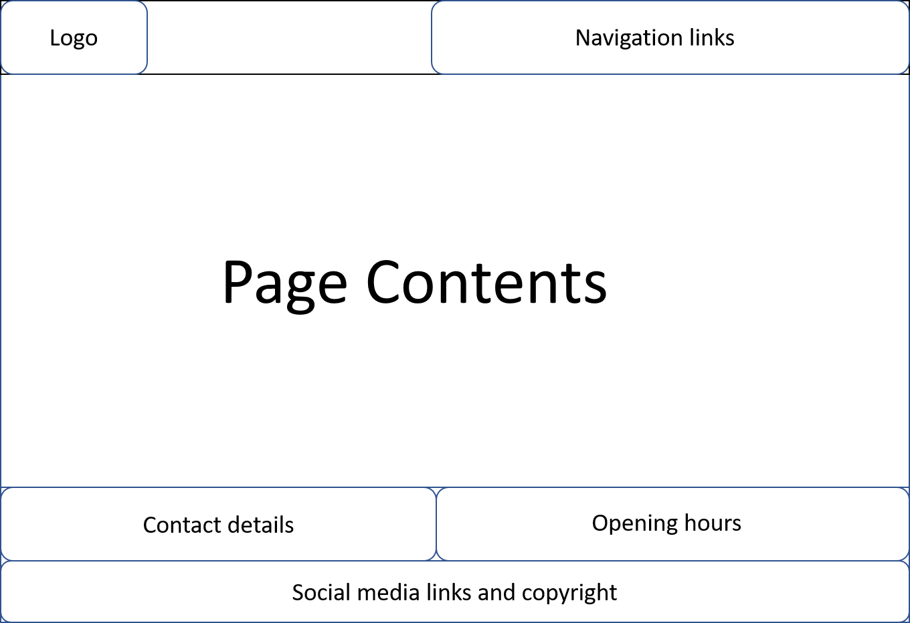
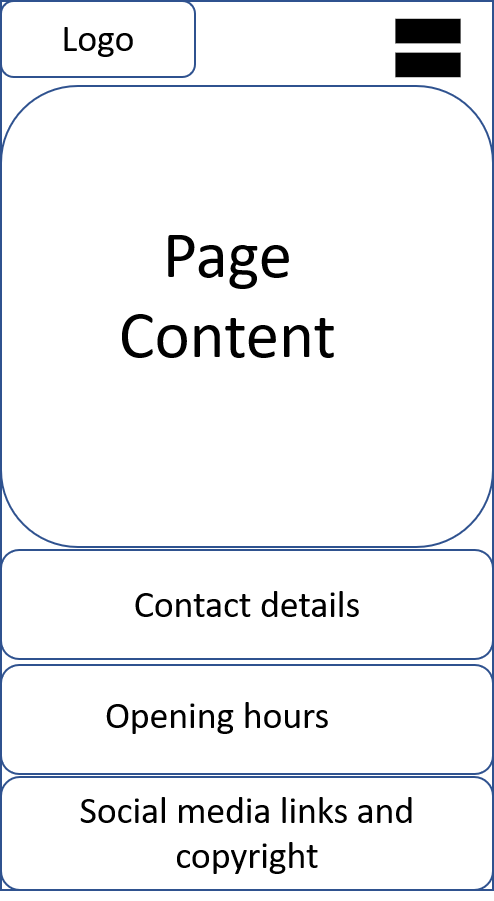

# Development life cycle.
I have followed the software developement life cycle.

## Requirement gathering
  - I want to see contact details of the restaurant
  - I want to see opening hours of the restaurant
  - I want to see the menu served by the restaurant
  - I want to book a table for dine in

## Analysis
  - Contact details and opening hours can be show besides each other
  - Menu page to show the list of menu being served by the restaurant
  - booking page
  - Additionaly, design home page/about page
  - Need a navigation to different page

## Design
  - Common page layout for desktop and tablet
  
  - Mobile page layout
  

## Implementation
  - Responsive design of a restaurant website
  - Static website implemented using HTML and CSS. 
  - Google Font is used. 
  - Semantic tags used in all pages.
  - Stylesheets/fonts are loaded in the head of the page
  - Logo in the header as rotation animation powered by css
  - CSS global variables are used (variables.css) for theming
  - Static files are located in assets folder
  - Google map in integrated using Google Map Generator [https://google-map-generator.com/]


### Project structure
```
│   .gitignore
│   about-navigation.html
│   about.html
│   booking-navigation.html
│   booking.html
│   index.html
│   LICENSE
│   menu-navigation.html
│   menu.html
│   navigation.html
│   README.md
│   robots.txt
│
├───assets
│   ├───css
│   │       booking-form.css
│   │       home.css
│   │       menu.css
│   │       styles.css
│   │       variables.css
│   │
│   ├───img
│   │       about.jpg
│   │       background.jpg
│   │       book-a-table.jpg
│   │       bread.jpg
│   │       cookies.jpg
│   │       donut.jpg
│   │       icon-512.png
│   │       menu.png
│   │       menu1.jpg
│   │       menu2.jpg
│   │       menu3.jpg
│   │       menu4.jpg
│   │       milkshake.jpg
│   │
│   └───pwa
│           icon-192x192.png
│           icon-256x256.png
│           icon-384x384.png
│           icon-512x512.png
│           manifest.json
│
└───docs
    │   BUGS.md
    │   CSS_VALIDATOR.md
    │   DEVELOPMENT_LIFE_CYCLE.md
    │   HTML_VALIDATOR.md
    │   TESTING.md
    │
    ├───css-validator
    │       booking-form.css.png
    │       home.css.png
    │       menu.css.png
    │       styles.css.png
    │       variables.css.png
    │
    ├───html-validator
    │       about-index.html.png
    │       about-navigation-index.html.png
    │       booking-index.html.png
    │       booking-navigation-index.html.png
    │       index.html.png
    │       menu-index.html.png
    │       menu-navigation-index.html.png
    │       navigation-index.html.png
    │
    ├───light-house-reports
    │       about.pdf
    │       home.pdf
    │       menu.pdf
    │
    ├───preview
    │   ├───desktop
    │   │       about.png
    │   │       booking(1).png
    │   │       booking(2).png
    │   │       home(1).png
    │   │       home(2).png
    │   │       menu(1).png
    │   │       menu(2).png
    │   │       menu(3).png
    │   │
    │   ├───mobile
    │   │       about(1).png
    │   │       about(2).png
    │   │       booling(1).png
    │   │       booling(2).png
    │   │       booling(3).png
    │   │       booling(4).png
    │   │       home(1).png
    │   │       home(2).png
    │   │       menu(1).png
    │   │       menu(2).png
    │   │       menu(3).png
    │   │       menu(4).png
    │   │       navigation.png
    │   │
    │   └───tablet
    │           about.png
    │           booking(1).png
    │           booking(2).png
    │           home(1).png
    │           home(2).png
    │           menu(1).png
    │           menu(2).png
    │           menu(3).png
    │
    └───wireframes
            desktop-tablet-layout.png
            mobile - navigation.png
            mobile-page-layout.png
            Wireframes.pptx 
```
### Pages (desktop/tablet/mobile)
  - [Home page](../index.html) 
    - [Mobile only Navigation (Home active)](../navigation.html) 
  - [About page](../about.html) 
    - [Mobile only Navigation (About active)](../about-navigation.html) 
  - [Menu page](../menu.html) 
    - [Mobile only Navigation (Menu active)](../menu-navigation.html) 
  - [Booking page](../booking.html)
    - [Mobile only Navigation (Booking active)](../booking-navigation.html)  


## Testing
Testing report found in [TESTING.md](./TESTING.md)