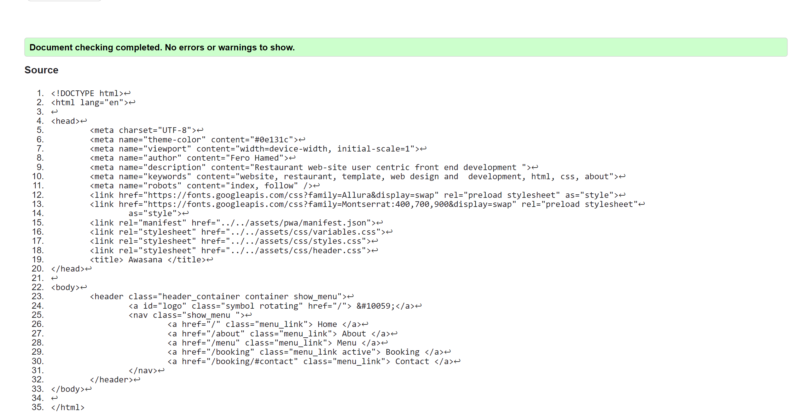

# HTML Validator 
HTML templates ate validated using https://validator.w3.org/nu/ (as text input)

## index.html

## about/index.html

## about/navigation/index.html

## menu/index.html

## menu/navigation/index.html

## booking/index.html

## booking/navigation/index.html

## navigation/index.html

